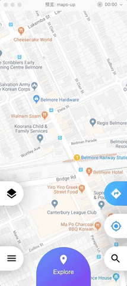

# JoinUs

Use Flutter💪 to implement the UI challenges on Uplabs, you can join us by implementing one of them. 

> English Version | [中文版本](README_CN.md)

### What is Flutter?

Flutter is Google’s portable UI toolkit for building beautiful, native applications for mobile, web, and desktop from a single codebase.

### What is Uplabs?

[Uplabs](https://www.uplabs.com/challenges) is a place for designers and developers to find, share and buy inspiration and resources to build apps and sites.

on Up, every designer and developer can:

**1.** Browse and find inspiration on our daily showcases for Material Design (Android), iOS & macOS, and Site.

**2.** Search for specific UI elements and solutions;

**3.** Share her/his work (design, library, snippet, app, site) as inspiration or as a freebie;

**4.** [Sell her/his work](https://www.uplabs.com/sell) (themes, templates, icons, etc).


There are many free designs on Uplabs, and developers can choose one of them, such as Google maps.


You can see the icon with **xd** on the right, which means that the project needs to be opened with Adobe XD after downloading. Of course, it also supports sketch, PS, Figma and so on.


Once opened, click on the preview button in the top right corner to preview the prototype interaction, which is important to achieve the interaction details.




All in all, for Flutter developers, this is a treasure.

Many interactions that are difficult or difficult to implement with native technology, using Flutter, can also have a satisfying result while exercising your Flutter skills.

### How to implement ？

We can implement a simple transition effect


**Question**: Now you can see from the UI diagram that the initial size of the square is 100, the starting position is centered, the distance is 100px from the bottom, the position after the transition is centered, the distance is 500px from the bottom, and the size is changed to 300, and the rounded corner is set to 30.

Knowing the start and end points, we can combine Stack and Positioned to complete the position change.

```dart
 Stack(
        children: <Widget>[
          Positioned(
            bottom: 100,
            left: (screenWidth - 100) / 2, //center
            width: 100,
            height: 100,
            child: DecoratedBox(
              decoration: BoxDecoration(
                color: Colors.red,
                border: Border.all(),
                borderRadius: BorderRadius.all(Radius.circular(0)),
              ),
            ),
          ),
        ],
      )
```

Then we can complete the animation, you can choose to combine multiple animations, but this will be a little troublesome, in fact, we only need to determine an animation, other animations are just incidental changes.

Here we use the offset of the bottom to animate. At the beginning, the distance from the bottom is 100. After the end, the distance from the bottom is 500. The time we choose is 500 milliseconds.

```dart
AnimationController animationController;
Animation animation;
//offset bottom
double offset = 0;
@override
void initState() {
  super.initState();
  animationController = AnimationController(duration: Duration(milliseconds: 500), vsync: this);
  animation = Tween<double>(begin: 0.0, end: 500.0-100.0).animate(animationController)
    ..addListener(() {
        // notify ui update
      setState(() {
        offset = animation.value;
      });
    });
}
```

When the animation is in progress, the offset can be updated to the value of the animation at this time, and then the UI update is notified by setState.

At this point, you need to change the expression of the bottom to:

```dart
 bottom: 100   ->   bottom:100+offset
```

However, in order to cause changes in other parameters of the square, it is better to get an offset to account for the total offset.

```dart
get currentPercent => offset / (500.0-100.0);
```

Then our expression can be written in another form:

```dart
 bottom: 100   ->   bottom:100+offset  -> bottom:100+(500.0-100.0)*currentPercent
```

With this logic, we can accomplish the above transition effects.

```dart
Stack(
  children: <Widget>[
    Positioned(
      // start 100, center end 500 center
      bottom: 100 + (500 - 100) * currentPercent,
      left: (screenWidth - (100 + (300 - 100) * currentPercent)) / 2,
      width: 100 + (300 - 100) * currentPercent,
      height: 100 + (300 - 100) * currentPercent,
      child: GestureDetector(
          onTap: () {
            if (animationController.status == AnimationStatus.completed) {
              animationController.reverse();
            } else {
              animationController.forward();
            }
          },
          child: DecoratedBox(
              decoration: BoxDecoration(
                  color: Colors.red,
                  border: Border.all(),
                  borderRadius: BorderRadius.all(Radius.circular(30 * currentPercent))))),
    )
  ],
)
```

#### Handling gestures

In the above code we have put a layer of GestureDetector, and then use the onTap callback to handle the click event, here again, plus the drag effect.


The vertical gesture monitoring can be handled by `onVerticalDragUpdate`. According to the returned `DragUpdateDetails` parameter, the sliding distance can be obtained. We can change the offset according to it.

```dart
onVerticalDragUpdate: (details) {
  // scrollUp means -=
  offset -= details.delta.dy;
  if (offset > 400) {
    offset = 400;
  } else if (offset < 0) {
    offset = 0;
  }
  setState(() {});
},
```

When the finger leaves the screen, we move to the appropriate position by animation according to the offset.

It should be noted that the value of the start of the animation is that the begin is changed, so our animation also needs to be created dynamically.

```dart
onVerticalDragEnd: (_) {
  if (isEnd) {
    if (currentPercent >= 0.7) {
      animate(true);
    } else {
      animate(false);
    }
  } else {
    if (currentPercent >= 0.3) {
      animate(true);
    } else {
      animate(false);
    }
  }
},
```

`isEnd` represents the end position, then look at the animation.

```dart
/// 滑动到开始或结束位置,Swipe to the start or end position
///
/// [end] true is the end position, otherwise the start position
/// [end] 为true是结束位置 反之是开始位置
void animate(bool end) {
  animationController = AnimationController(
      duration: Duration(milliseconds: (1 + 500 * (isEnd ? currentPercent : (1.0 - currentPercent))).toInt()),
      vsync: this);
  animation = Tween<double>(begin: offset, end: end ? 400.0 : 0.0).animate(animationController)
    ..addListener(() {
      setState(() {
        offset = animation.value;
      });
    })
    ..addStatusListener((status) {
      if (status == AnimationStatus.completed) {
        isEnd = !isEnd;
      }
    });
  animationController.forward();
}
```

The value of begin is offset, but the value of end needs to be changed by sliding to the start or end position. **It should be noted that the animation time also needs to be changed according to the offset offset. **

Other more complex interactions are just the same routine. You can check out [flutter_challenge_googlemaps](https://github.com/flutter-ui-challenges/flutter_challenge_googlemaps) to see it. The renderings are as follows:


### Join in Flutter-UI-Challenges

In order to let more developers try the Flutter technology, and realize the beautiful interaction while understanding the charm of Flutter, I created the organization of [Flutter-UI-Challenges](https://github.com/flutter-ui-challenges) on GitHub.

Developers can join us by implementing a UI challenge in [Uplabs](https://www.uplabs.com/challenges).

If you have completed one of these challenges, congratulations, if you want to submit and join us, you can mention Issue in [JoinUs](https://github.com/flutter-ui-challenges/JoinUs) in the following format:

> 


The format of the Issue name is **flutter_chanllenge_xx**, such as `flutter_challenge_googlemaps`.

Please attach the **URL of the UI Challenge on Uplabs** and the URL of the **GitHub implementation**.

**Note**: Please put the joinus tag on the Issue


We will review it to determine if it can be passed. The review includes:

- **Is the effect consistent?**

Completed at least 80%

- **Quality**

We not only require beautiful interactions, but also the pursuit of higher code quality, complete and dart-compliant comments and streamlined code is our pursuit.

- **Compliance with specifications**

The project name starts with **flutter_chanllenge_**

For the format of Readme, please refer to [flutter_challenge_googlemaps](https://github.com/flutter-ui-challenges/flutter_challenge_googlemaps/blob/master/README.md)

Comments and reasonable code splits that conform to the [Dart documentation](http://dart.goodev.org/guides/language/effective-dart) specification are required.

### Finally

**looking forward to your joining.**


