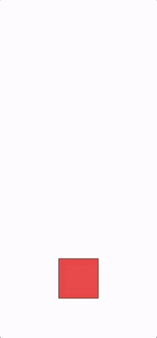
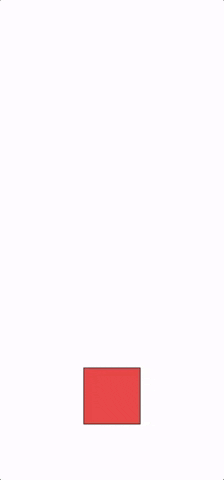
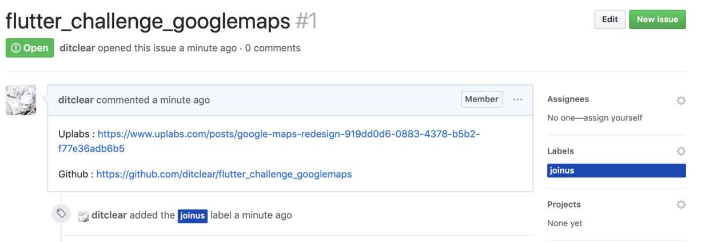

# JoinUs

Use Flutter💪 to implement the UI challenges on Uplabs, you can join us by implementing one of them. 

> 使用Flutter来完成Uplabs上的UI挑战,你可以通过实现其中一种来加入我们。

### What is Flutter?

Flutter is Google’s portable UI toolkit for building beautiful, native applications for mobile, web, and desktop from a single codebase.

> Flutter 是 Google 用以帮助开发者在 ~~iOS 和 Android 两个平台~~（现在是全平台）开发高质量原生 UI 的移动 SDK。Flutter 兼容现有的代码，免费并且开源，在全球开发者中广泛被使用.

### What is Uplabs?

[Uplabs](https://www.uplabs.com/challenges) is a place for designers and developers to find, share and buy inspiration and resources to build apps and sites.

on Up, every designer and developer can:

**1.** Browse and find inspiration on our daily showcases for Material Design (Android), iOS & macOS, and Site.

**2.** Search for specific UI elements and solutions;

**3.** Share her/his work (design, library, snippet, app, site) as inspiration or as a freebie;

**4.** [Sell her/his work](https://www.uplabs.com/sell) (themes, templates, icons, etc).


> [Uplabs](https://www.uplabs.com/challenges)是设计师和开发人员寻找，分享和购买灵感和资源以构建应用和网站的地方。
>
> 在这里，每个人都可以：
>
> **1.** 浏览并在我们的Material Design（Android），iOS和macOS以及Site的日常展示中找到灵感。
>
> **2.** 搜索特定的UI元素和解决方案;
>
> **3.** 分享她/他的作品（设计，图书馆，片段，应用程序，网站）作为灵感或免费赠品;
>
> **4.** [出售她/他的作品](https://www.uplabs.com/sell)(主题，模板，图标等)。


All in all, for Flutter developers, this is a treasure.

Many interactions that are difficult or difficult to implement with native technology, using Flutter, can also have a satisfying result while exercising your Flutter skills.


> 总的来说，对于Flutter开发者而言，这里就是一座宝库。
>
> 许多用原生技术都难以实现或者较难实现的交互，运用Flutter，在锻炼你的Flutter技能同时还能有一个满意😊的结果。

### How to implement ？

We can implement a simple transition effect

> 我们可以来实现一个简单的过渡效果



**Question**: Now you can see from the UI diagram that the initial size of the square is 100, the starting position is centered, the distance is 100px from the bottom, the position after the transition is centered, the distance is 500px from the bottom, and the size is changed to 300, and the rounded corner is set to 30.

> 问题：现在通过UI图可以得知正方形的初始大小为100，起始位置为居中、距离底部100px，经过过渡后的位置为居中、距离底部500px,同时大小改为300，设置圆角为30.

Knowing the start and end points, we can combine Stack and Positioned to complete the position change.

> 知道了起点和终点，我们可以结合Stack和Positioned来完成位置的变化。

```dart
 Stack(
        children: <Widget>[
          Positioned(
            bottom: 100,
            left: (screenWidth - 100) / 2, //center
            width: 100,
            height: 100,
            child: DecoratedBox(
              decoration: BoxDecoration(
                color: Colors.red,
                border: Border.all(),
                borderRadius: BorderRadius.all(Radius.circular(0)),
              ),
            ),
          ),
        ],
      )
```

Then we can complete the animation, you can choose to combine multiple animations, but this will be a little troublesome, in fact, we only need to determine an animation, other animations are just incidental changes.

Here we use the offset of the bottom to animate. At the beginning, the distance from the bottom is 100. After the end, the distance from the bottom is 500. The time we choose is 500 milliseconds.

> 接着我们来完成动画，你可以选择组合多个动画，但这样会稍显麻烦，其实我们只需要确定一个动画，其它的动画只是附带引起的变化而已。
>
> 这里选用bottom的偏移进行动画，开始的时候距离底部为100，结束之后距离底部为500，时间我们挑选为500毫秒。

```dart
AnimationController animationController;
Animation animation;
//offset bottom
double offset = 0;
@override
void initState() {
  super.initState();
  animationController = AnimationController(duration: Duration(milliseconds: 500), vsync: this);
  animation = Tween<double>(begin: 0.0, end: 500.0-100.0).animate(animationController)
    ..addListener(() {
        // notify ui update
      setState(() {
        offset = animation.value;
      });
    });
}
```

When the animation is in progress, the offset can be updated to the value of the animation at this time, and then the UI update is notified by setState.

> 当动画进行时，offset就可以更新为动画这时候的值，然后通过setState通知UI更新。

At this point, you need to change the expression of the bottom to:

> 这时，就需要更改bottom的表达式为：

```dart
 bottom: 100   ->   bottom:100+offset
```

However, in order to cause changes in other parameters of the square, it is better to get an offset to account for the total offset.

> 但是为了引起正方形其它参数的变化，因此，我们最好是得到一个offset占总偏移量的比重。

```dart
get currentPercent => offset / (500.0-100.0);
```

Then our expression can be written in another form:

> 接着我们的表达式也可以用另一种形式来写：

```dart
 bottom: 100   ->   bottom:100+offset  -> bottom:100+(500.0-100.0)*currentPercent
```

With this logic, we can accomplish the above transition effects.

> 用这样的逻辑，我们便可以完成上述的过渡效果。

```dart
Stack(
  children: <Widget>[
    Positioned(
      // start 100, center end 500 center
      bottom: 100 + (500 - 100) * currentPercent,
      left: (screenWidth - (100 + (300 - 100) * currentPercent)) / 2,
      width: 100 + (300 - 100) * currentPercent,
      height: 100 + (300 - 100) * currentPercent,
      child: GestureDetector(
          onTap: () {
            if (animationController.status == AnimationStatus.completed) {
              animationController.reverse();
            } else {
              animationController.forward();
            }
          },
          child: DecoratedBox(
              decoration: BoxDecoration(
                  color: Colors.red,
                  border: Border.all(),
                  borderRadius: BorderRadius.all(Radius.circular(30 * currentPercent))))),
    )
  ],
)
```

#### 处理手势,Handling gestures

In the above code we have put a layer of GestureDetector, and then use the onTap callback to handle the click event, here again, plus the drag effect.

> 在上面的代码中我们已经套上了一层GestureDetector，然后通过onTap回调来处理点击事件，这里再进一步，再加上拖动效果。



The vertical gesture monitoring can be handled by `onVerticalDragEnd`. According to the returned `DragUpdateDetails` parameter, the sliding distance can be obtained. We can change the offset according to it.

> 垂直方向的手势监听可以通过`onVerticalDragEnd`来处理，根据返回的`DragUpdateDetails`参数，可以获取的滑动距离，我们可以根据它来改变offset。

```dart
onVerticalDragUpdate: (details) {
  // scrollUp means -=
  offset -= details.delta.dy;
  if (offset > 400) {
    offset = 400;
  } else if (offset < 0) {
    offset = 0;
  }
  setState(() {});
},
```

When the finger leaves the screen, we move to the appropriate position by animation according to the offset.

It should be noted that the value of the start of the animation is that the begin is changed, so our animation also needs to be created dynamically.

> 当手指离开屏幕的时候，我们再根据offset的大小和状态通过动画移动到合适的位置。
>
> 需要注意的是动画开始的值也就是begin是变化的，因此我们的动画也需要动态创建。

```dart
onVerticalDragEnd: (_) {
  if (isEnd) {
    if (currentPercent >= 0.7) {
      animate(true);
    } else {
      animate(false);
    }
  } else {
    if (currentPercent >= 0.3) {
      animate(true);
    } else {
      animate(false);
    }
  }
},
```

`isEnd` represents the end position, then look at the animation.

> `isEnd`代表处于结束位置，再来看看动画。

```dart
/// 滑动到开始或结束位置,Swipe to the start or end position
///
/// [end] true is the end position, otherwise the start position
/// [end] 为true是结束位置 反之是开始位置
void animate(bool end) {
  animationController = AnimationController(
      duration: Duration(milliseconds: (1 + 500 * (isEnd ? currentPercent : (1.0 - currentPercent))).toInt()),
      vsync: this);
  animation = Tween<double>(begin: offset, end: end ? 400.0 : 0.0).animate(animationController)
    ..addListener(() {
      setState(() {
        offset = animation.value;
      });
    })
    ..addStatusListener((status) {
      if (status == AnimationStatus.completed) {
        isEnd = !isEnd;
      }
    });
  animationController.forward();
}
```

The value of begin is offset, but the value of end needs to be changed by sliding to the start or end position. **It should be noted that the animation time also needs to be changed according to the offset offset. **

> begin的值都是offset，只是end的值需要通过是滑动到开始或结束位置而改变，**需要注意的就是动画时间也需要根据偏移量offset有所变化。**

Other more complex interactions are just the same routine. You can check out [flutter_challenge_googlemaps](https://github.com/flutter-ui-challenges/flutter_challenge_googlemaps) to see it. The renderings are as follows:

> 其它更为复杂的交互也不过是同一个套路，你可以查看[flutter_challenge_googlemaps](https://github.com/flutter-ui-challenges/flutter_challenge_googlemaps)来了解它，效果图如下：


### Join in Flutter-UI-Challenges

In order to let more developers try the Flutter technology, and realize the beautiful interaction while understanding the charm of Flutter, I created the organization of [Flutter-UI-Challenges](https://github.com/flutter-ui-challenges) on GitHub.

Developers can join us by implementing a UI challenge in [Uplabs](https://www.uplabs.com/challenges).

> 为了让更多的开发者尝试Flutter技术，在体会到Flutter魅力的同时完成精美的交互，我在GitHub上创建了[Flutter-UI-Challenges](https://github.com/flutter-ui-challenges)这个组织。
> 开发者可以通过实现[Uplabs](https://www.uplabs.com/challenges)中一个UI挑战来加入我们。

If you have completed one of these challenges, congratulations, if you want to submit and join us, you can mention Issue in [JoinUs](https://github.com/flutter-ui-challenges/JoinUs) in the following format:

> 如果你完成了其中一个挑战，恭喜你，如果你想提交并加入我们，那么可以在 [JoinUs](https://github.com/flutter-ui-challenges/JoinUs)中提Issue，格式如下：




The format of the Issue name is **flutter_chanllenge_xx**, such as `flutter_challenge_googlemaps`.

Please attach the **URL of the UI Challenge on Uplabs** and the URL of the **GitHub implementation**.

**Note**: Please put the joinus tag on the Issue

> Issue名称的格式为**flutter_chanllenge_xx**，比如`flutter_challenge_googlemaps`.
>
> 内容请附上 **Uplabs 上UI挑战的网址**和**GitHub相应实现的网址**。
>
> **注意**: 请给Issue打上joinus标签

We will review it to determine if it can be passed. The review includes:

> 我们会对其进行评审以决定是否可以通过，评审内容包括：

- **Is the effect consistent?**，**效果是否相符？**

Completed at least 80%，完成度至少在80%以上，

- **Quality**，**质量**

We not only require beautiful interactions, but also the pursuit of higher code quality, complete and dart-compliant comments and streamlined code is our pursuit.

> 我们不仅要求能实现精美的交互效果，同时也追求更高的代码的质量，完善且符合dart规范的注释和精简有力的代码是我们的追求。

- **Compliance with specifications**，**符合规范**

The project name starts with **flutter_chanllenge_**

For the format of Readme, please refer to [flutter_challenge_googlemaps](https://github.com/flutter-ui-challenges/flutter_challenge_googlemaps/blob/master/README.md)

Comments and reasonable code splits that conform to the [Dart documentation](http://dart.goodev.org/guides/language/effective-dart) specification are required.

> 项目名请以**flutter_chanllenge_**开头
>
> Readme的格式请参考[flutter_challenge_googlemaps](https://github.com/flutter-ui-challenges/flutter_challenge_googlemaps/blob/master/README.md)
>
> 要求有符合[Dart文档规范](http://dart.goodev.org/guides/language/effective-dart)的注释和合理的代码拆分。

**Finally, looking forward to your joining.**

最后，期待您的加入。


